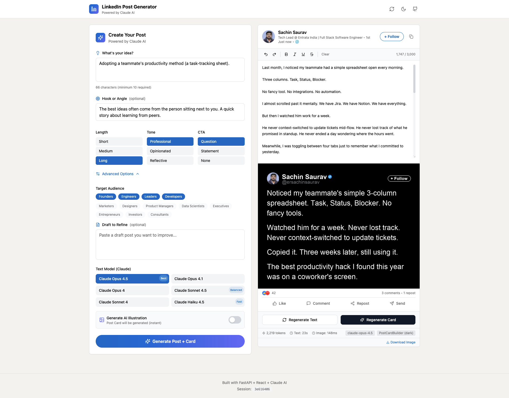
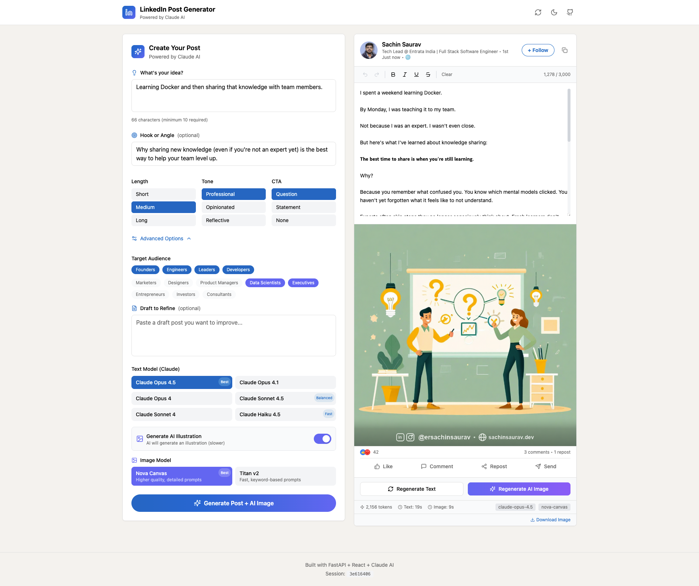
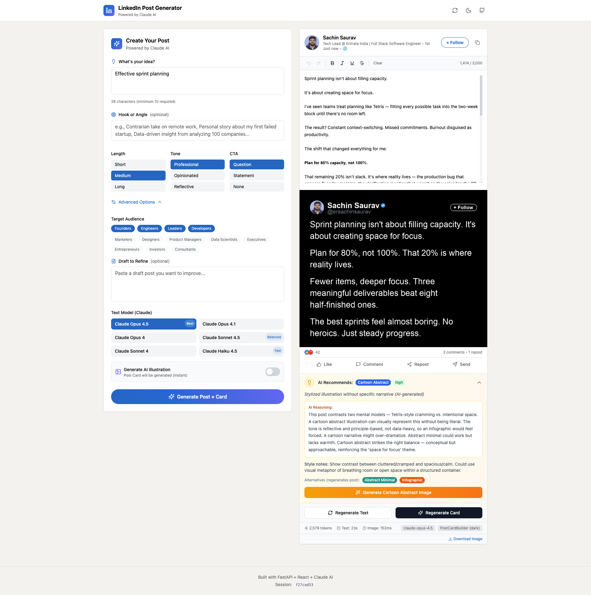
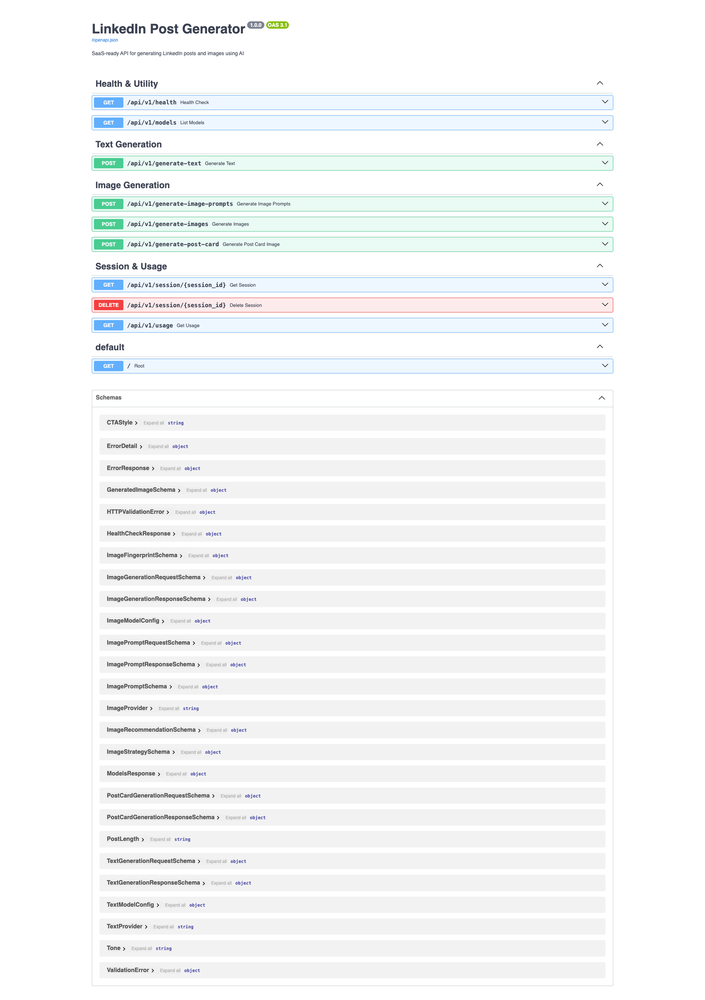

# LinkedIn Post Generator 🚀

[](https://opensource.org/licenses/MIT)
[](https://www.python.org/downloads/)
[](https://nodejs.org/)

AI-powered LinkedIn post and image generator with multi-provider support (AWS Bedrock Claude, Ollama, SDXL) and intelligent content recommendations.

> **Open Source**: This project is fully customizable! See [Personalization](#-personalization) to set up your own branding.

## ✨ Features

### Text Generation
- **Multi-Provider Support**: AWS Bedrock (Claude Opus/Sonnet/Haiku) and Ollama (Qwen/Mistral/Llama)
- **Smart 3-Step Pipeline**: Ollama models use a specialized pipeline for 95%+ success rate
- **Customizable Parameters**: Post length, tone, audience targeting, CTA styles
- **Unicode Formatting**: Bold, italic, strikethrough support for LinkedIn
- **Intelligent Hashtag Generation**: Content-relevant + personal branding hashtags

### Image Generation
- **AI Image Generation**: SDXL (local, free), Amazon Nova Canvas, Titan Image Generator
- **Smart Recommendations**: AI analyzes your post and suggests the best image type
- **Multiple Image Types**:
  - **Post Cards**: Instant typography cards (zero AI cost, code-generated)
  - **AI Illustrations**: Cartoon narrative, abstract, minimal styles
  - **Infographics**: Data visualization with text overlays
  - **Carousels**: Multi-slide LinkedIn carousels with AI cover + post card sections

### Advanced Features
- **LinkedIn-Style Preview**: Real-time preview exactly as it appears in the feed
- **Editable Content**: Inline editing with undo/redo support
- **PDF Export**: Merge multiple images into carousel-ready PDFs
- **Session Management**: Persistent state across generation steps
- **Usage Logging**: Track tokens, costs, and API usage
- **Prompt Logging**: Full audit trail for debugging and optimization

## 📸 Screenshots

> **Note**: Screenshots show example usage. Your interface will display your own branding after customization.

### Post Card Generation (Instant, Zero AI Cost)

*Full interface: Input form (left), LinkedIn preview (center), and dark typography post card (right). Post cards are code-generated instantly—no AI needed!*

### AI Image Generation (SDXL/Nova Canvas)

*AI-powered illustration generated by SDXL or Amazon Nova Canvas. Toggle "Generate AI Illustration" to create matching visuals for your post.*

### Smart Image Recommendations

*AI analyzes your post and recommends the best image type (Cartoon Abstract, Infographic, etc.) with detailed reasoning and style notes.*

### API Documentation (Swagger)

*Interactive API documentation at `/docs` - test all endpoints directly from the browser. Powered by FastAPI's auto-generated OpenAPI specs.*

---

## 🏗️ Architecture

```
┌─────────────────────────────────────────────────────────────────────────────┐
│                    FRONTEND (React 18 + Vite + TypeScript)                  │
│  ┌───────────────┐  ┌─────────────────┐  ┌────────────────────────────────┐ │
│  │  Input Form   │  │ LinkedIn Preview│  │  Image Gallery                 │ │
│  │  - Idea       │  │ - Editable text │  │  - Post Cards / AI Images      │ │
│  │  - Tone       │  │ - Undo/Redo     │  │  - Carousels                   │ │
│  │  - Audience   │  │ - Formatting    │  │  - PDF download                │ │
│  │  - Model      │  │ - Copy/export   │  │  - Regenerate                  │ │
│  └───────────────┘  └─────────────────┘  └────────────────────────────────┘ │
│                                                                             │
│  UI: Radix UI + Tailwind CSS + Framer Motion + TanStack Query               │
└────────────────────────────────┬────────────────────────────────────────────┘
                                 │ HTTP/REST
                                 ▼
┌─────────────────────────────────────────────────────────────────────────────┐
│                       BACKEND (FastAPI + Python 3.11+)                      │
│  ┌────────────────────────────────────────────────────────────────────────┐ │
│  │ Modular Routes                                                         │ │
│  │ routes_text.py │ routes_image.py │ routes_health.py │ routes_session   │ │
│  └────────────────────────────────────────────────────────────────────────┘ │
│  ┌────────────────────────────────────────────────────────────────────────┐ │
│  │ Providers (Abstract Base + Implementations)                            │ │
│  │ BedrockTextProvider │ OllamaTextProvider (3-step pipeline)             │ │
│  │ NovaCanvasProvider │ TitanImageProvider │ SDXLWebUIProvider            │ │
│  └────────────────────────────────────────────────────────────────────────┘ │
│  ┌────────────────────────────────────────────────────────────────────────┐ │
│  │ Services                                                               │ │
│  │ SessionManager │ ImageProcessor │ PostCardBuilder │ CarouselBuilder    │ │
│  │ InfographicRenderer │ PromptLogger │ UsageLogger                       │ │
│  └────────────────────────────────────────────────────────────────────────┘ │
└────────────────────────────────┬────────────────────────────────────────────┘
                                 ▼
┌─────────────────────────────────────────────────────────────────────────────┐
│                           AI PROVIDERS                                      │
│  ┌─────────────────┐  ┌─────────────────┐  ┌─────────────────────────────┐  │
│  │   AWS Bedrock   │  │     Ollama      │  │      SDXL WebUI             │  │
│  │  Claude Opus    │  │  Qwen 2.5:7B    │  │  Stable Diffusion XL        │  │
│  │  Claude Sonnet  │  │  Mistral:7B     │  │  (Local, Free)              │  │
│  │  Claude Haiku   │  │  Llama3:8B      │  │                             │  │
│  │  Nova Canvas    │  │  (Local, Free)  │  │                             │  │
│  │  Titan Image    │  │                 │  │                             │  │
│  └─────────────────┘  └─────────────────┘  └─────────────────────────────┘  │
└─────────────────────────────────────────────────────────────────────────────┘
```

## 🚀 Quick Start

### Prerequisites

- Python 3.11+
- Node.js 18+
- **At least one AI provider** (see options below)

**AI Provider Options:**

| Provider | Type | Cost | Setup |
|----------|------|------|-------|
| **Ollama** | Local | Free | [Install Ollama](https://ollama.ai), run `ollama pull qwen2.5:7b` |
| **AWS Bedrock** | Cloud | Paid | Configure `~/.aws/credentials` |
| **SDXL WebUI** | Local | Free | Run [Automatic1111](https://github.com/AUTOMATIC1111/stable-diffusion-webui) on port 7860 |

> **Recommended for beginners**: Start with Ollama (free, local) for text generation.

### Installation

```bash
# Clone the repository
git clone https://github.com/YOUR_USERNAME/linkedin_post_generator.git
cd linkedin_post_generator

# Copy environment template
cp env.example .env

# Edit .env with your settings (see Personalization section)
nano .env  # or your preferred editor

# One-command launch (creates venv, installs deps, starts both servers)
chmod +x launch.sh
./launch.sh
```

This starts:
- **Backend**: http://localhost:5170 (Python + FastAPI)
- **Frontend**: http://localhost:5173 (React + Vite)
- **API Documentation**: http://localhost:5170/docs (Swagger)

### Manual Setup

**Backend:**
```bash
python3 -m venv venv
source venv/bin/activate
pip install -r requirements.txt
uvicorn backend.main:app --host 0.0.0.0 --port 5170 --reload
```

**Frontend:**
```bash
cd frontend
npm install
npm run dev
```

### Launch Options

```bash
./launch.sh              # Start both backend and frontend
./launch.sh --backend    # Backend only
./launch.sh --frontend   # Frontend only
./launch.sh --prod       # Production mode (no hot reload)
```

## 🎨 Personalization

### Configure Your Branding (Single .env file!)

Copy `env.example` to `.env` and update with your details:

```bash
cp env.example .env
nano .env  # or your preferred editor
```

**All branding is configured in ONE file:**

```env
# Backend (image footers, hashtags)
BRAND_NAME=Your Name
BRAND_HANDLE=@yourusername
BRAND_WEBSITE=yourwebsite.com
BRAND_LINKEDIN_URL=linkedin.com/in/yourusername
BRAND_INSTAGRAM_URL=instagram.com/yourusername

# Frontend (UI preview) - VITE_ prefix required
VITE_BRAND_NAME=Your Name
VITE_BRAND_HANDLE=@yourusername
VITE_BRAND_TITLE=Your Professional Title | Your Company
VITE_BRAND_VERIFIED=false
VITE_BRAND_WEBSITE=yourwebsite.com
VITE_BRAND_LINKEDIN_URL=linkedin.com/in/yourusername
VITE_BRAND_INSTAGRAM_URL=instagram.com/yourusername
```

> **Why two sets?** Backend uses standard env vars. Frontend requires `VITE_` prefix (Vite security feature). Keep them in sync!

### Add Your Profile Picture (Optional)

1. Add your photo: `frontend/src/images/profilePicture.jpeg`

2. Update imports in **TWO files**:

   **`frontend/src/App.tsx`** (line ~62-65):
   ```typescript
   // import profilePicture from './images/placeholder-avatar.svg';
   import profilePicture from './images/profilePicture.jpeg';
   ```

   **`frontend/src/components/LinkedInPreview.tsx`** (line ~56-57):
   ```typescript
   // import profilePicture from '../images/placeholder-avatar.svg';
   import profilePicture from '../images/profilePicture.jpeg';
   ```

**Image specs:** JPEG/PNG, 200x200px+, under 500KB

## 📡 API Endpoints

| Endpoint | Method | Description |
|----------|--------|-------------|
| `/api/v1/health` | GET | Health check + provider status |
| `/api/v1/models` | GET | List available text and image models |
| `/api/v1/generate-text` | POST | Generate LinkedIn post text + image prompts |
| `/api/v1/generate-image-prompts` | POST | Generate image prompts from finalized text |
| `/api/v1/generate-images` | POST | Generate images from prompts |
| `/api/v1/generate-post-card` | POST | Generate instant typography post card |
| `/api/v1/session/{session_id}` | GET | Get session state |
| `/api/v1/usage/daily` | GET | Get daily usage statistics |

### Example: Generate Text

```bash
curl -X POST http://localhost:5170/api/v1/generate-text \
  -H "Content-Type: application/json" \
  -d '{
    "session_id": "my-session-123",
    "idea": "Why most developers waste time on wrong optimizations",
    "post_length": "medium",
    "tone": "opinionated",
    "audience": ["engineers", "founders"],
    "cta_style": "question",
    "text_model": {
      "provider": "bedrock",
      "model": "claude-opus-4.5"
    },
    "generate_images": true,
    "image_model": {
      "provider": "sdxl",
      "model": "sdxl"
    }
  }'
```

### Example: Generate Images

```bash
curl -X POST http://localhost:5170/api/v1/generate-images \
  -H "Content-Type: application/json" \
  -d '{
    "session_id": "my-session-123",
    "image_model": {
      "provider": "sdxl",
      "model": "sdxl"
    },
    "generate_carousel": false
  }'
```

### Example: Generate Post Card (Instant, No AI)

```bash
curl -X POST http://localhost:5170/api/v1/generate-post-card \
  -H "Content-Type: application/json" \
  -d '{
    "session_id": "my-session-123",
    "post_text": "The best code is the code you never write.\n\nEvery line is a liability.",
    "theme": "dark",
    "name": "Your Name",
    "handle": "@yourusername",
    "verified": false
  }'
```

## 🤖 Available Models

### Text Generation

| Provider | Model | Speed | Quality | Best For |
|----------|-------|-------|---------|----------|
| **Bedrock** | `claude-opus-4.5` | Slow | ⭐⭐⭐⭐⭐ | Best quality posts (recommended) |
| **Bedrock** | `claude-sonnet-4.5` | Medium | ⭐⭐⭐⭐ | Balanced performance |
| **Bedrock** | `claude-haiku-4.5` | Fast | ⭐⭐⭐ | Quick iterations |
| **Ollama** | `qwen2.5:7b` | Fast | ⭐⭐⭐⭐ | Analytical content (local, free) |
| **Ollama** | `mistral:7b` | Fast | ⭐⭐⭐ | Professional content (local, free) |
| **Ollama** | `llama3:8b` | Fast | ⭐⭐⭐ | Creative content (local, free) |

> **Note**: Ollama models use a specialized 3-step pipeline (Content → Style → JSON) for 95%+ success rate with structured output.

### Image Generation

| Provider | Model | Type | Best For |
|----------|-------|------|----------|
| **SDXL** | `sdxl` | Local | High-quality illustrations (free, recommended) |
| **Nova** | `nova-canvas` | Cloud | Professional visuals |
| **Titan** | `titan-image-generator-v2` | Cloud | Fallback option |
| **Code** | Post Card | Instant | Typography cards (zero AI cost) |

## 📁 Project Structure

```
linkedin_post_generator/
├── backend/
│   ├── api/
│   │   ├── routes.py                   # Combined router
│   │   ├── routes_text.py              # Text generation endpoints
│   │   ├── routes_image.py             # Image generation endpoints
│   │   ├── routes_health.py            # Health & utility endpoints
│   │   ├── routes_session.py           # Session management
│   │   ├── provider_factory.py         # Provider instantiation
│   │   └── schemas.py                  # Pydantic request/response models
│   ├── providers/
│   │   ├── base.py                     # Abstract base classes
│   │   ├── bedrock_text.py             # AWS Bedrock Claude provider
│   │   ├── ollama_text.py              # Ollama provider (3-step pipeline)
│   │   ├── nova_image.py               # Amazon Nova Canvas provider
│   │   ├── titan_image.py              # Amazon Titan provider
│   │   └── sdxl_image.py               # SDXL WebUI provider
│   ├── services/
│   │   ├── session_manager.py          # Async session storage
│   │   ├── image_processor.py          # Image post-processing & PDF
│   │   ├── post_card_builder.py        # Typography card generator
│   │   ├── carousel_builder.py         # LinkedIn carousel builder
│   │   ├── infographic_renderer.py     # Text overlay renderer
│   │   ├── quote_card_builder.py       # Quote-style cards
│   │   ├── text_extractor.py           # Post text structure extraction
│   │   ├── prompt_logger.py            # Prompt audit logging
│   │   └── usage_logger.py             # Usage & cost tracking
│   ├── prompts/
│   │   ├── linkedin_text.py            # Text generation prompts
│   │   ├── ollama_linkedin_text.py     # Ollama-specific prompts
│   │   ├── pipeline_prompts.py         # 3-step pipeline prompts
│   │   ├── image_prompts.py            # Image prompt templates
│   │   └── image_gen/                  # Modular image prompt system
│   │       ├── base.py                 # Prompt context & builder
│   │       ├── models/                 # Model-specific prompts
│   │       │   ├── nova.py
│   │       │   ├── sdxl.py
│   │       │   └── titan.py
│   │       └── usecases/               # Use-case specific prompts
│   │           ├── background.py
│   │           ├── carousel.py
│   │           ├── illustration.py
│   │           └── postcard.py
│   ├── assets/
│   │   └── fonts/                      # Custom fonts for post cards
│   ├── utils/
│   │   └── constants.py                # Enums, defaults, branding
│   ├── config.py                       # Environment configuration
│   └── main.py                         # FastAPI application entry
├── frontend/
│   └── src/
│       ├── components/
│       │   ├── InputForm.tsx           # Generation parameters form
│       │   ├── LinkedInPreview.tsx     # Editable post preview
│       │   ├── ImagePreview.tsx        # Image gallery & download
│       │   ├── RecommendationSection.tsx # AI image recommendations
│       │   ├── PostcardCreator.tsx     # Manual postcard creator
│       │   ├── TabLayout.tsx           # Navigation tabs
│       │   └── TextPreview.tsx         # Text formatting preview
│       ├── hooks/
│       │   ├── useGenerateText.ts      # Text generation hook
│       │   ├── useGenerateImages.ts    # Image generation hook
│       │   └── useGeneratePostCard.ts  # Post card generation hook
│       ├── lib/
│       │   ├── api.ts                  # API client
│       │   ├── constants.ts            # App constants & config
│       │   ├── defaults.ts             # Default form values
│       │   ├── unicode.ts              # Unicode text formatting
│       │   └── utils.ts                # Utility functions
│       ├── types/
│       │   └── index.ts                # TypeScript type definitions
│       ├── App.tsx                     # Main application component
│       └── main.tsx                    # React entry point
├── logs/                               # Runtime logs (gitignored)
│   ├── prompts/                        # Prompt audit logs
│   │   ├── text_prompts_YYYY-MM-DD.jsonl
│   │   └── image_prompts_YYYY-MM-DD.jsonl
│   └── usage_YYYY-MM-DD.jsonl          # Usage tracking logs
├── docs/
│   └── screenshots/                    # Documentation screenshots
├── requirements.txt                    # Python dependencies
├── launch.sh                           # One-command launcher
├── kill_services.sh                    # Stop all services
└── README.md
```

## 🎨 Image Types & Recommendations

The AI analyzes your post content and recommends the best image type:

| Type | Description | When to Use |
|------|-------------|-------------|
| **Text Only** | No image - whitespace reinforces message | Quiet, reflective posts |
| **Post Card** | Typography card with profile pic (instant, no AI) | Text-focused posts, quotes |
| **Cartoon Narrative** | Illustrated scene with characters | Story-driven, engaging posts |
| **Cartoon Abstract** | Stylized illustration without narrative | Professional, modern feel |
| **Abstract Minimal** | Geometric shapes, minimalist | Clean, sophisticated posts |
| **Infographic** | Data visualization with text overlays | Stats, processes, lists |

## 🎠 Carousel Generation

Generate LinkedIn carousels with:
1. **AI-Generated Cover**: Illustrated cover image with title overlay
2. **Section Cards**: Auto-generated from post structure
3. **Takeaway Slide**: Final slide with CTA
4. **PDF Export**: Ready for LinkedIn upload

The carousel builder:
- Extracts dominant colors from cover for consistent theming
- Adds navigation arrows between slides
- Includes branded footer on all slides
- Generates SEO-friendly PDF filenames

## 💰 Cost Controls

- **Token caps**: Max 4000 output tokens per generation
- **Image limits**: Max 7 images per request
- **Post cards**: Zero AI cost (pure code generation)
- **Local models**: Ollama + SDXL = completely free
- **Usage logging**: All operations tracked in `logs/`

## 🔧 Configuration

All settings are in `.env` (see `env.example` for full list):

```env
# AI Providers
AWS_REGION=us-east-1
OLLAMA_BASE_URL=http://localhost:11434
SDXL_WEBUI_URL=http://localhost:7860

# SDXL Settings
SDXL_STEPS=25
SDXL_SAMPLER=DPM++ 2M Karras
SDXL_CFG_SCALE=6.5

# App Settings
DEBUG=false
LOG_LEVEL=INFO
SESSION_TTL_SECONDS=3600
```

See [Personalization](#-personalization) for branding configuration.

## 📝 Development

```bash
# Backend with auto-reload
uvicorn backend.main:app --host 0.0.0.0 --port 5170 --reload

# Frontend with HMR
cd frontend && npm run dev

# Type check frontend
cd frontend && npx tsc --noEmit

# Run tests
pytest

# View logs
cat logs/prompts/text_prompts_$(date +%Y-%m-%d).jsonl | jq .
```

## 🔍 Logging & Debugging

### Log Files

| File | Contents |
|------|----------|
| `logs/usage_YYYY-MM-DD.jsonl` | API usage, tokens, duration |
| `logs/prompts/text_prompts_*.jsonl` | Full text generation prompts |
| `logs/prompts/image_prompts_*.jsonl` | Image generation prompts |

### Useful Commands

```bash
# View today's text prompts
cat logs/prompts/text_prompts_$(date +%Y-%m-%d).jsonl | jq .

# Count generations by model
cat logs/usage_*.jsonl | jq -r '.model' | sort | uniq -c

# Find failed requests
cat logs/usage_*.jsonl | jq 'select(.success == false)'

# View Ollama pipeline steps
cat logs/prompts/text_prompts_*.jsonl | jq 'select(.type == "pipeline_step")'
```

## 🛠️ Tech Stack

### Backend
- **FastAPI** - Modern async Python web framework
- **Pydantic** - Data validation and settings management
- **boto3** - AWS SDK for Bedrock
- **httpx** - Async HTTP client for Ollama/SDXL
- **Pillow** - Image processing
- **ReportLab** - PDF generation

### Frontend
- **React 18** - UI framework
- **TypeScript** - Type safety
- **Vite** - Build tool with HMR
- **Tailwind CSS** - Utility-first styling
- **Radix UI** - Accessible components
- **Framer Motion** - Animations
- **TanStack Query** - Server state management

## 🤝 Contributing

Contributions are welcome! Please see [CONTRIBUTING.md](CONTRIBUTING.md) for guidelines.

### Ways to Contribute

- 🐛 Report bugs and issues
- 💡 Suggest new features
- 🔧 Submit pull requests
- 📖 Improve documentation
- ⭐ Star the repo if you find it useful!

## 📄 License

This project is licensed under the MIT License - see the [LICENSE](LICENSE) file for details.

---

**Powered by** AWS Bedrock (Claude & Nova), Ollama, SDXL, React, Python, and FastAPI.

If you find this project useful, please consider giving it a ⭐!
